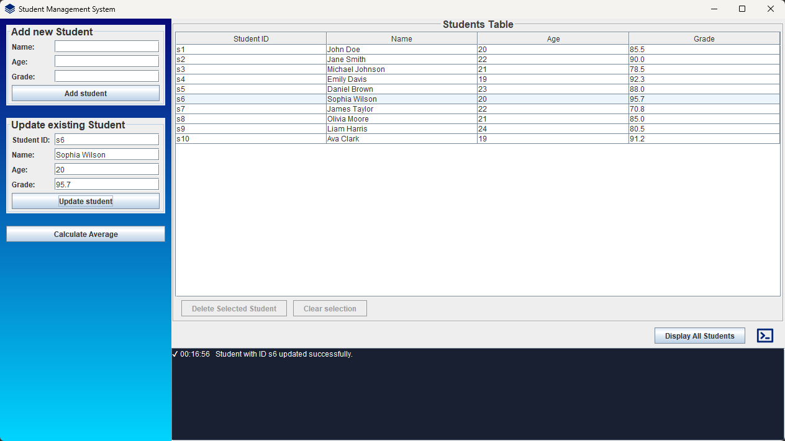

# Students Management System | Java CRUD

## Prerequisites

1. **Java Development Kit (JDK)**:
    - Ensure you have JDK 23 or higher installed.
    - Verify installation by running:
      ```bash
      java -version
      ```

2. **Maven**:
    - Install Maven for dependency management and building the project.
    - Verify installation by running:
      ```bash
      mvn -version
      ```

3. **SQLite**:
    - The application uses SQLite as the database. You don't need to install SQLite manually since the application will create and manage the `students.db` file automatically.
    - Useful scripts can be found in `db/util.sql` file.

## Build the Project
1. Navigate to the project directory
2. Run the following command to compile and package the application:
      ```bash
      mvn clean package
      ```
   
## Run the Application
After building, execute the application with:
   ```bash
   java -jar target/students-app-mp-1.0-SNAPSHOT.jar
   ```
or run the application with `--insert-test-records` flag to insert sample records to students table:
   ```bash
   java -jar target/students-app-mp-1.0-SNAPSHOT.jar --insert-test-records
   ```
